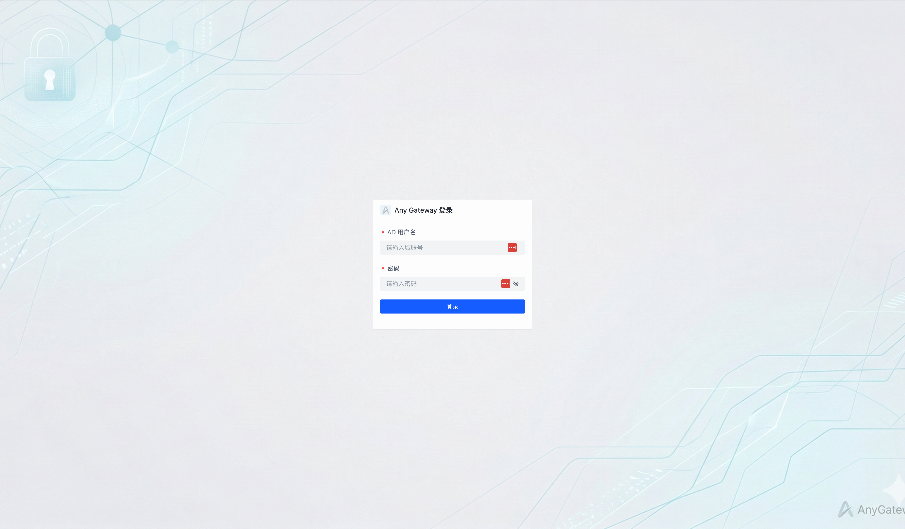
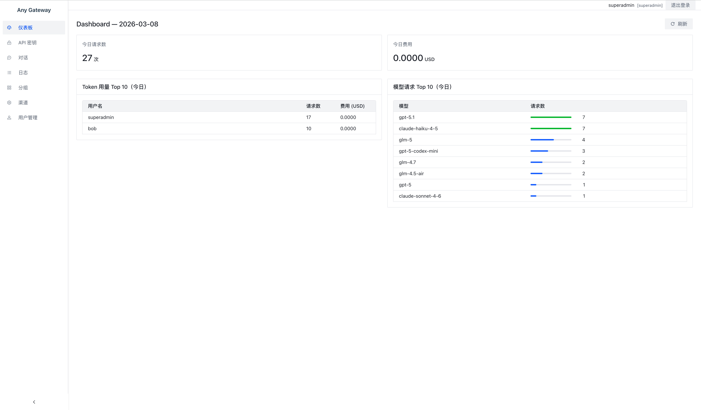
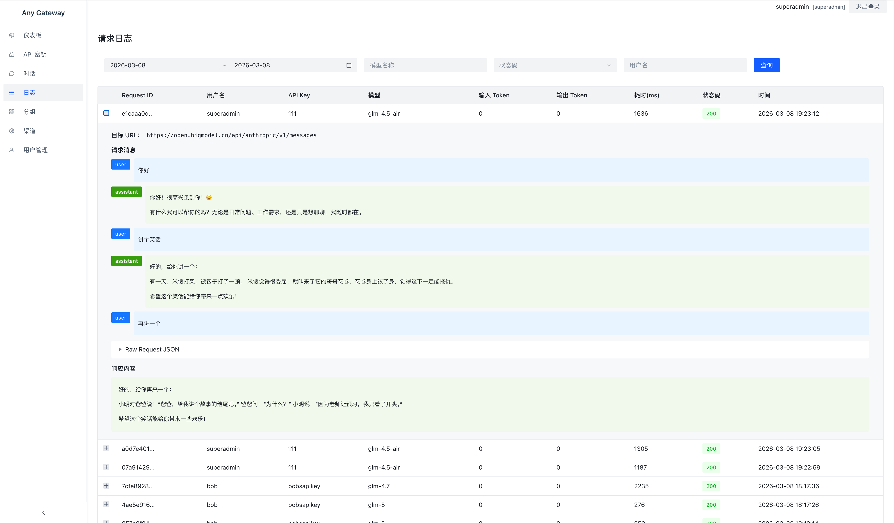

# Any Gateway

自托管 AI API 网关，将请求代理到多个后端 AI 提供商（OpenAI、Anthropic、Gemini），并提供用户管理、配额控制和审计日志功能。





## 功能特性

- **多提供商路由** — 支持 OpenAI 兼容、Anthropic、Gemini 协议，自动识别请求格式
- **加权负载均衡** — 通过可配置权重在多个渠道间分配流量
- **用户分组访问控制** — 将用户分配到分组，按优先级控制渠道访问权限
- **API Key 管理** — 签发 `sk-*` 格式的密钥，支持单 Key 配额限制和过期时间
- **配额强制执行** — 转发请求前检查 Token USD 用量，超额直接拦截
- **LDAP/AD 认证** — 通过 Active Directory Simple Bind 实现企业级登录
- **JWT 管理员认证** — 基于角色的管理端访问控制（`user`、`admin`、`superadmin`）
- **审计日志** — 按 Token 和日期存储的 Brotli 压缩 JSONL 日志
- **React 管理后台** — 用于管理渠道、分组、用户和 Token 的完整 SPA
- **流式响应支持** — SSE 透传，支持 AI 流式输出

## 技术亮点

### 1. 现代化的开发效率工具 (SQLModel + FastCRUD)
该项目在后端采用了 **SQLModel**，这是目前 Python 领域非常先进的 ORM 框架，它完美结合了 SQLAlchemy 的数据库能力和 Pydantic 的数据验证能力，使得代码既具备强类型检查又非常简洁。配合 **FastCRUD** 使用，大幅减少了编写基础 CRUD（增删改查）代码的工作量，让开发者能更专注于路由分发和限额逻辑的实现。

### 2. 针对 AI 场景的并发优化 (Asyncio + HTTPX)
- **异步代理：** 使用 **httpx** 作为 HTTP 客户端，配合 FastAPI 的原生异步支持，能够高效处理大量并发的 AI 接口请求，而不会阻塞主线程。
- **非阻塞审计日志：** 为了防止在高并发请求下写入日志导致性能瓶颈，项目使用了 **asyncio queue（3 消费者模式）**。这种设计确保了请求响应能立即返回给用户，而重量级的日志写入和 **Brotli 压缩** 操作则在后台异步完成，有效规避了文件锁定竞争问题。

### 3. 企业级安全与身份管理 (LDAP + RBAC)
- **身份验证：** 通过 **ldap3** 库实现的 LDAP/AD 集成，意味着该工具可以直接接入企业现有的活动目录（Active Directory），无需用户重新注册账号，符合企业内部工具的安全合规要求。
- **权限模型：** 利用 **python-jose** 实现的 JWT 认证体系，构建了清晰的 RBAC（基于角色的访问控制）模型，区分了普通用户、管理员和超级管理员的权限范围。

### 4. 前端状态与性能平衡 (React 19 + Zustand)
- **最新前端标准：** 采用了 **React 19**，搭配 **Vite** 构建工具，确保了极快的开发反馈和生产环境加载速度。
- **轻量化状态管理：** 放弃了笨重的 Redux，转而使用 **Zustand**。Zustand 以其极简的 API 和高性能著称，非常适合用于管理管理后台中复杂的 UI 状态（如通道配置、Token 额度实时显示等）。

### 5. 数据存储与归档设计
- **存储灵活性：** 支持从轻量级的 **SQLite** 平滑迁移到生产级的 **PostgreSQL**，满足从个人测试到团队使用的不同规模需求。
- **压缩归档：** 日志系统不仅按天和按 Token 分片，还强制使用 **Brotli 算法** 压缩。相比传统的 Gzip，Brotli 能提供更高的压缩比，对于存储大量的 JSON 格式 AI 对话日志非常有效。

## 架构

```
any_gateway/
├── gateway.py          # FastAPI 应用，路由逻辑，请求转发
├── main.py             # 进程管理器（同时启动网关 + 前端）
├── constants.py        # 全局常量（端口、限制等）
├── log_writer.py       # 异步 JSONL 日志（brotli 压缩，asyncio 队列，3 个消费者）
├── admin/
│   └── router.py       # 管理端点：FastCRUD 自动 CRUD + 自定义业务逻辑
├── db/
│   ├── models.py       # SQLModel 数据模型
│   └── database.py     # 异步 SQLAlchemy 引擎配置
├── middleware/
│   └── auth.py         # API Key 中间件（校验 Token 存在/冻结/额度/过期）
└── services/
    ├── auth_service.py # JWT 签发/验证、角色管理、超级管理员初始化
    ├── ldap_auth.py    # LDAP Simple Bind + 应急 fallback key
    └── quota.py        # 额度检查与用量更新

apps/react/src/
├── pages/              # Login、Dashboard、ApiKeys、Chat、Channels、Groups、Users、Logs
├── api/                # axios HTTP 客户端模块
├── components/         # Layout（导航栏）、AuthGuard（路由保护）
├── router/             # React Router 配置
└── store/              # Zustand 全局状态（当前用户、JWT token）
```

## 认证三层体系

| 层级 | 方式 | 作用范围 |
|---|---|---|
| 用户登录 | LDAP Simple Bind / fallback key | 签发 24h JWT |
| 管理 API | JWT Bearer 或 `x-admin-key` 请求头 | `/admin/*` 端点 |
| AI API 调用 | `x-api-key: sk-*` 或 `Authorization: Bearer sk-*` | `/v1/*` 端点 |

### 权限角色

- `user` — 访问自己的 Token（`/user/tokens/*`）
- `admin` — 全部管理功能（`/admin/*`）
- `superadmin` — admin 超集 + 用户角色管理 + 不受分组限制的渠道访问

## 路由策略

1. 获取用户所属分组，按 `priority` 降序排列
2. 在支持所请求模型的最高优先级分组内，按 weight 加权随机选取一个渠道
3. `superadmin` 和 `_admin_fallback` 跳过分组路由，直接访问所有已启用渠道

模型别名通过渠道级 `model_mapping` 解析（例如 `{"gpt-4o": "claude-opus-4-5"}`）。

## 环境要求

- Python 3.11+
- Node.js 18+（前端开发时需要）
- LDAP/AD 服务器（本地开发可使用内置 mock 服务器）

## 快速开始

### 1. 安装依赖

```bash
pip install -r requirements.txt
```

### 2. 配置环境变量

```bash
cp .env.example .env  # 或手动设置环境变量
```

必填变量：

```bash
ADMIN_KEY=<管理接口密钥>
JWT_SECRET=<JWT 签名随机密钥>
ADMIN_FALLBACK_KEY=<应急登录密钥>
SUPERADMIN_USERNAME=<超级管理员用户名>
```

可选变量：

```bash
LDAP_SERVER_URL=ldap://dc.company.internal
LDAP_BASE_DN=DC=company,DC=internal
LDAP_DOMAIN=COMPANY
JWT_EXPIRE_HOURS=24
DATABASE_URL=sqlite+aiosqlite:///./data/gateway.db  # 默认值
```

### 3. 启动

```bash
# 网关 + 前端（端口 8003）
python any_gateway/main.py

# 仅网关
uvicorn any_gateway.gateway:app --host 0.0.0.0 --port 8003 --reload
```

管理后台地址：`http://localhost:8003`

## Docker

```bash
# 包含 mock LDAP 服务器
docker-compose up

# 仅网关
docker build -t any_gateway .
docker run -p 8003:8003 \
  -e ADMIN_KEY=your-key \
  -e JWT_SECRET=your-secret \
  -e ADMIN_FALLBACK_KEY=your-fallback \
  -v $(pwd)/data:/app/data \
  any_gateway
```

## 前端开发

```bash
cd apps/react
npm install
npm run dev   # 开发服务器，自动代理 /admin、/user、/auth 到 :8003
npm run build # 生产构建（输出由网关直接服务）
npm run lint
```

## API 说明

### 健康检查

```
GET /health
```

### AI 接口（OpenAI 兼容）

```
POST /v1/chat/completions
POST /v1/messages          # Anthropic 协议
GET  /v1/models
```

认证：`x-api-key: sk-*` 或 `Authorization: Bearer sk-*`

### 认证

```
POST /auth/login           # LDAP 登录 → JWT
GET  /auth/me              # 当前用户信息
```

### 用户接口（需要 JWT）

```
GET    /user/tokens        # 查看自己的 Token 列表
POST   /user/tokens        # 创建 Token
DELETE /user/tokens/{id}   # 删除 Token
```

### 管理接口（需要 JWT 或 x-admin-key）

```
/admin/channels               # 渠道 CRUD
/admin/groups                 # 分组 CRUD
/admin/tokens                 # Token CRUD
/admin/users                  # 用户 CRUD
/admin/users/{username}/role  # 角色管理（仅 superadmin）
```

## 审计日志

请求/响应对异步写入：

```
data/sessions/{YYYY_MM_DD}/{token_id}.jsonl.br
```

每个文件为 Brotli 压缩的 JSONL 格式，按 Token 和日期各存一个文件。3 个 asyncio 消费者并发处理写入队列，每文件一把异步锁防止并发写冲突。

## 测试

```bash
# 运行所有测试
pytest tests/

# 运行单个测试文件
pytest tests/test_admin_router.py -v

# 运行单个测试函数
pytest tests/test_admin_router.py::test_create_token -v
```

测试使用 SQLite 内存数据库和 FastAPI 的 `TestClient`。

## 技术栈

| 组件 | 技术 |
|---|---|
| 后端框架 | FastAPI |
| 数据库 ORM | SQLModel + FastCRUD |
| 数据库 | SQLite（默认）/ PostgreSQL |
| 认证 | ldap3、python-jose |
| 审计日志 | brotli + asyncio 队列 |
| HTTP 客户端 | httpx |
| 前端 | React 19 + TypeScript + Vite |
| 状态管理 | Zustand |
| HTTP 请求 | axios |
